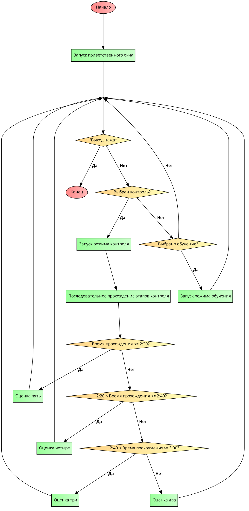

# Эмулятор ПУИ

Для отрисовки UI была выбран модуль dearpygui. Прибор состоит из базовых изображений, которые перерисовываются, если их состояние изменятся (статические текстуры). Интерактивные элементы - кнопки, тумблеры, дисплей и led-индикация. Код выполнен в функциональном стиле (?) без лишних наворотов. 

Стек:  

        dearpygui                
        python 3.10
        numpy

## Инструкция по использованию

- Установить Python 3.10, Visual Studio Code(VSC): 

    [Ссылка на инструкцию ](https://learn.microsoft.com/ru-ru/windows/python/beginners)

- Установить требуемые пакеты
        
        Открыть папку с проектом в VSC, открыть терминал VSC, ввести следующее:
        python3.10 -m pip install -r requriments.txt
        Нажать Enter

- Запустить проект:

        python3.10 main.py

## Принцип работы

## Планы

- Отрисовать назавание тумблеров для запуска [✅]
- Доделать основное меню и возможность выбора в нем [✅]
- Добавить поля ввода и алгоритм расчета параметров [✅]
- По мере готовности собрать exe_шник [✅]

